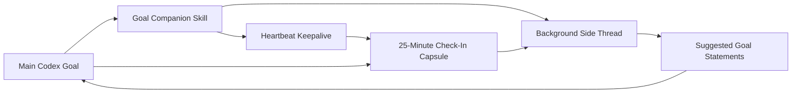

# Goal Companion Skill


A Codex skill that gives long-running goals a second brain.

Goal Companion creates a background side thread for active Codex goals, feeds it compact checkpoints, and asks it to suggest sharper goal statements as the work unfolds. Every 25 minutes, it should also give the user a readable check-in: what happened since the last check-in, what evidence changed, what is blocked, and what goal statement now fits best.

## Why

Long Codex runs can start with a goal that feels clear, then drift as discovery, blockers, tests, and scope changes pile up. Goal Companion turns that drift into an explicit feedback loop:

- What happened since the last check-in?
- What is the current goal now that we know more?
- What evidence proves the goal is done?
- What should stay out of scope?
- When should the agent stop, pause, escalate, or ask the user?

It is basically a quiet goal editor riding shotgun.

## What It Does

- Creates a Codex background side thread for goal refinement.
- Runs a long-goal heartbeat every 25 minutes.
- Gives the user a concise overview of what happened since the last check-in.
- Sends milestone checkpoints after planning, discovery, implementation, testing, blockers, and finalization.
- Suggests updated goal statements alongside each check-in summary.
- Defines acceptance criteria, stop conditions, risks, and next checkpoint questions.
- Includes an idempotent installer for a standing Codex instruction.
- Updates older Goal Companion standing-instruction blocks when the skill evolves.

## Important Limitation

This skill does **not** patch Codex's native `/goal` command or install a true product-level slash-command hook.

Instead, it works through:

1. Skill trigger metadata.
2. A standing instruction in `AGENTS.md`.
3. Codex thread and automation tools when available.

That means it can behave like an upgraded goal mode, but it still depends on Codex seeing the goal-start context.

## Install

Clone this repo into your Codex skills directory.

### Windows PowerShell

```powershell
git clone https://github.com/bhupendrafire-ai/goal-companion-skill "$env:USERPROFILE\.codex\skills\goal-companion"
```

### macOS / Linux

```bash
git clone https://github.com/bhupendrafire-ai/goal-companion-skill ~/.codex/skills/goal-companion
```

Restart Codex or open a fresh thread if the skill does not appear immediately.

## First Use

Invoke it explicitly once:

```text
Use $goal-companion with this goal: Build the dashboard and keep the run aligned until it is verified.
```

On first use, the skill checks whether this block exists in your Codex `AGENTS.md`:

```md
<!-- goal-companion:start -->
# Goal Companion
- Whenever I start a goal, use goal-companion and create a background side thread to refine goal statements.
- Every 25 minutes during long goals, give me a concise overview of what happened since the last check-in, send that checkpoint to the companion, and include suggested updated goal statements with the summary.
- Stop the keepalive when the goal finishes.
<!-- goal-companion:end -->
```

If the block is missing or older, the installer can append or update the marker-delimited block safely.

## Usage

Explicit invocation:

```text
Use $goal-companion to create a side thread that refines this goal as the run proceeds.
```

Goal-style invocation after the standing instruction is installed:

```text
/goal Build and verify the export workflow end to end.
```

The companion should then help refine the active objective as checkpoints come in.

## The 25-Minute Check-In

For long goals, each heartbeat should produce a small check-in capsule:

```text
Since last check-in:
<what changed in plain language>

Evidence:
- <tests, files, logs, screenshots, decisions, or observed behavior>

Blockers or drift:
- <anything slowing, widening, or changing the run>

Suggested goal statements:
- Recommended: <best current goal statement>
- Tighter: <smaller version if useful>
- Stretch: <broader version if useful>

Next 25-minute focus:
<the clearest next move>
```

This is the core upgrade: the heartbeat is not just a wakeup. It becomes a useful progress digest and goal-tuning moment.

## How It Works



The side thread does not execute the task. It reviews progress summaries and returns better goal language, criteria, risks, and stopping rules.

## Repository Layout

```text
.
├── SKILL.md
├── agents/
│   └── openai.yaml
├── references/
│   └── templates.md
└── scripts/
    └── install_standing_instruction.py
```

## Safety

Goal Companion is intentionally conservative:

- It does not silently rewrite your active goal.
- It asks before installing global standing instructions.
- It keeps companion updates compact and public.
- It falls back to checkpoint-only mode if thread or automation tools are unavailable.
- It pauses keepalive behavior when the goal finishes, is canceled, or is blocked.

## Roadmap Ideas

- Smarter duplicate side-thread detection.
- A local status file for active companion thread IDs.
- Optional Obsidian/second-brain handoff summaries.
- A dashboard view for active goals and companion suggestions.
- Native `/goal` integration if Codex exposes slash-command hooks.

## License

No license has been added yet. Add one before others reuse or redistribute this skill.

---

Built as a first public repo and a small experiment in making long agent runs feel less blurry.
