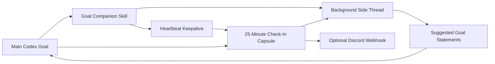

# Goal Companion Skill


A quiet Codex skill for long-running goals that need a second brain.

Goal Companion can create a background side thread for explicitly enabled long Codex goals, feed it compact checkpoints, and ask it to suggest sharper goal statements as the work unfolds. By default it stays quiet: no side thread, heartbeat, Discord setup prompt, or repeated goal rewrites unless the user asks for that behavior. Optionally, a brief public review of enabled check-ins can be sent to Discord through a locally stored webhook.

## Why

Long Codex runs can start with a goal that feels clear, then drift as discovery, blockers, tests, and scope changes pile up. Goal Companion turns that drift into an explicit feedback loop:

- What happened since the last check-in?
- What is the current goal now that we know more?
- What evidence proves the goal is done?
- What should stay out of scope?
- When should the agent stop, pause, escalate, or ask the user?

It is basically a quiet goal editor riding shotgun.

## What It Does

- Creates a Codex background side thread for goal refinement when explicitly enabled.
- Runs a long-goal heartbeat every 25 minutes only when the user opts in.
- Gives the user a concise overview of meaningful changes since the last check-in.
- Sends milestone checkpoints after meaningful planning, discovery, implementation, testing, blockers, and finalization.
- Suggests updated goal statements only when requested or when the goal materially changes.
- Optionally posts a short public progress review to Discord through a webhook when requested.
- Defines acceptance criteria, stop conditions, risks, and next checkpoint questions.
- Includes idempotent installers for standing Codex instructions and local Discord setup.
- Updates older Goal Companion standing-instruction blocks when the skill evolves.

## Important Limitation

This skill does **not** patch Codex's native `/goal` command or install a true product-level slash-command hook.

Instead, it works through:

1. Skill trigger metadata.
2. A standing instruction in `AGENTS.md`.
3. Codex thread and automation tools when available.

That means it can behave like an upgraded goal mode, but it still depends on Codex seeing the goal-start context.

## Install

Clone this repo into your Codex skills directory.

### Windows PowerShell

```powershell
git clone https://github.com/bhupendrafire-ai/goal-companion-skill "$env:USERPROFILE\.codex\skills\goal-companion"
```

### macOS / Linux

```bash
git clone https://github.com/bhupendrafire-ai/goal-companion-skill ~/.codex/skills/goal-companion
```

Restart Codex or open a fresh thread if the skill does not appear immediately.

## First Use

Invoke it explicitly once:

```text
Use $goal-companion with this goal: Build the dashboard and keep the run aligned until it is verified.
```

On first use, the skill checks whether this block exists in your Codex `AGENTS.md`:

```md
<!-- goal-companion:start -->
# Goal Companion
- Use goal-companion only when I explicitly ask for it, ask for a companion side thread, ask for goal check-ins/keepalive, or ask to refine a goal statement.
- For ordinary short goals, stay quiet: no side thread, heartbeat, Discord prompt, or repeated goal rewrites.
- For long goals where I opt in, give concise check-ins about meaningful changes, send compact checkpoints to the companion, and suggest updated goal statements only when scope, risk, acceptance criteria, or stop conditions changed.
- If Discord delivery is explicitly requested and locally configured, send only a brief public review of what happened since the previous check-in with mentions disabled and no secrets.
- Pause the keepalive when the goal finishes, is canceled, or is genuinely blocked.
<!-- goal-companion:end -->
```

If the block is missing or older, the installer can append or update the marker-delimited block safely.

## Usage

Explicit invocation:

```text
Use $goal-companion to create a side thread that refines this goal as the run proceeds.
```

Long-goal invocation after the standing instruction is installed:

```text
/goal Use Goal Companion keepalive while you build and verify the export workflow end to end.
```

The companion should then help refine the active objective as meaningful checkpoints come in. Ordinary short goals should not trigger side threads or heartbeats.

## Discord Webhook Setup

Discord delivery is optional. A Discord webhook URL is a secret because anyone with it can post to that channel. Do **not** paste the webhook URL into Codex chat, GitHub, README files, issue comments, or logs.

Configure it locally with the hidden prompt:

```powershell
py -3 $env:USERPROFILE\.codex\skills\goal-companion\scripts\discord_webhook.py configure
```

Check status without revealing the URL:

```powershell
py -3 $env:USERPROFILE\.codex\skills\goal-companion\scripts\discord_webhook.py status
```

Send a safe test message only when you mean to post to Discord:

```powershell
py -3 $env:USERPROFILE\.codex\skills\goal-companion\scripts\discord_webhook.py test --yes
```

Remove the local webhook config:

```powershell
py -3 $env:USERPROFILE\.codex\skills\goal-companion\scripts\discord_webhook.py clear
```

By default, the webhook URL is stored at:

```text
%LOCALAPPDATA%\GoalCompanion\discord.json
```

Set `GOAL_COMPANION_DISCORD_CONFIG` to use a different local config file.

The sender follows Discord webhook basics from the official [Discord Webhook Resource](https://docs.discord.com/developers/resources/webhook): it sends JSON with message content or embeds, uses `?wait=true` for visible failures, and disables mentions with `allowed_mentions`.

## The 25-Minute Check-In

For explicitly enabled long goals, each heartbeat should produce a small check-in capsule:

```text
Since last check-in:
<what changed in plain language>

Evidence:
- <tests, files, logs, screenshots, decisions, or observed behavior>

Blockers or drift:
- <anything slowing, widening, or changing the run>

Suggested goal statements:
- <only when requested or materially changed; otherwise "No material change">

Next 25-minute focus:
<the clearest next move>
```

If Discord is configured, Discord receives only a brief public review of what happened since the previous check-in. The Discord message does not include the active goal or suggested goal statements. The helper redacts Discord webhook URLs, common token-looking values, bearer tokens, and visible ping patterns such as `@everyone`, `@here`, and raw Discord mentions.

This is the core upgrade: the heartbeat is not just a wakeup. It becomes a useful progress digest and goal-tuning moment.

## How It Works



The side thread does not execute the task. It reviews progress summaries and returns better goal language, criteria, risks, and stopping rules.

## Repository Layout

```text
.
├── SKILL.md
├── agents/
│   └── openai.yaml
├── references/
│   └── templates.md
└── scripts/
    ├── discord_webhook.py
    └── install_standing_instruction.py
```

## Safety

Goal Companion is intentionally conservative:

- It does not silently rewrite your active goal.
- It asks before installing global standing instructions.
- It keeps companion and Discord updates public and compact.
- It never needs the Discord webhook URL in chat.
- It stores Discord config outside the repo and prints only a fingerprint.
- It falls back to checkpoint-only mode if thread, automation, or Discord tools are unavailable.
- It pauses keepalive behavior when the goal finishes, is canceled, or is blocked.

## Roadmap Ideas

- Smarter duplicate side-thread detection.
- A local status file for active companion thread IDs.
- Optional Obsidian/second-brain handoff summaries.
- A dashboard view for active goals and companion suggestions.
- Native `/goal` integration if Codex exposes slash-command hooks.

## License

No license has been added yet. Add one before others reuse or redistribute this skill.

---

Built as a first public repo and a small experiment in making long agent runs feel less blurry.
